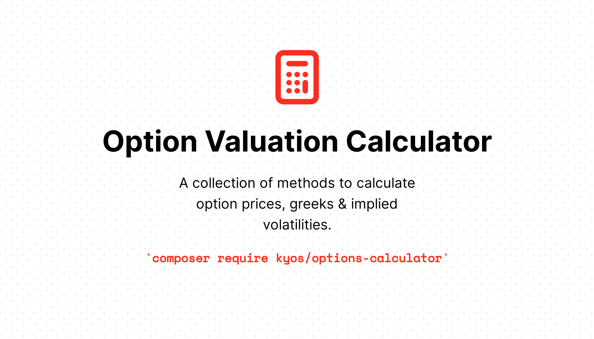

# Option Valuation Calculator

[](https://packagist.org/packages/kyos/options-calculator)
[](https://github.com/kyosenergy/options-calculator/actions/workflows/run-tests.yml)
[](https://github.com/kyosenergy/options-calculator/actions?query=workflow%3A"Check+%26+fix+styling"+branch%3Amaster)
[](https://packagist.org/packages/kyos/options-calculator)

**A collection of methods to calculate option prices, greeks & implied volatilities.**

Range of supported products:
- European options on futures, using the Black'76 methodology. 
 
Range of supported methodologies to derive implied volatilities:
- Bisection search algorithm.

## Installation

You can install the package via composer:

```bash
composer require kyos/options-calculator
```

## Usage

```php
use Kyos\OptionsCalculator\Black76;

$bs = new Black76();
echo $bs->getValues(Black76::CALL, 10.5, 12, 0.082, 0.60);
// [
//     'value' => 0.2405826183655344,
//     'delta' => 0.24449431791580983,
//     'gamma' => 0.17399585222314845,
//     'vega' => 0.009438057012140243,
//     'theta' => -3.450541861184725,
//     'rho' => -0.00019727774705973822,
// ]

echo $bs->getValues(Black76::PUT, 10.5, 12, 0.082, 0.60);
// [
//     'value' => 1.7393531225277215,
//     'delta' => -0.7546860181923143,
//     'gamma' => 0.17399585222314845,
//     'vega' => 0.009438057012140243,
//     'theta' => -3.435554156143103,
//     'rho' => -0.0014262695604727318,
// ]

echo $bs->getImpliedVolatility(Black76::CALL, 10.5, 12, 0.082, 0.2405826183655344);
// 0.60
echo $bs->getImpliedVolatility(Black76::PUT, 10.5, 12, 0.082, 1.7393531225277215);
// 0.60
```

## Testing

```bash
composer test
```

## Changelog

Please see [CHANGELOG](CHANGELOG.md) for more information on what has changed recently.

## Contributing

Please see [CONTRIBUTING](.github/CONTRIBUTING.md) for details.

## Security Vulnerabilities

Please review [our security policy](../../security/policy) on how to report security vulnerabilities.

## Credits

- [Emilian Enev](https://github.com/Enev)
- [Zois Pagoulatos](https://github.com/zoispag)
- [All Contributors](../../contributors)

## License

The MIT License (MIT). Please see [License File](LICENSE.md) for more information.
